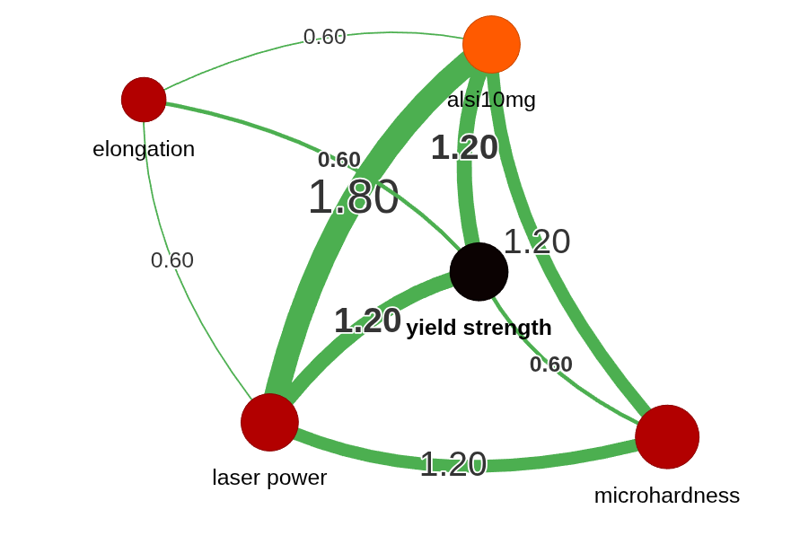

# Information fusion for unraveling laser-microstructure information

# Query Driven Vectorless RAG for Laser and/or Microstructure Related Documents

 (stable model, As indicated by the name 1s single call or 1 stage, No LLM fallback when the exact term of query is not found during the interactive chat, corresponding version-v76)

 (stable model, As indicated by the name 2s double call or 2 stage, LLM fallback when the exact term of query is not found during the interactive chat, corresponding version-v79 or v80, To slow )

# Materials

Microstructure phase

Types of Elements and Alloys/Compounds (Association with Periodic Table)

# Laser

Types of Laser Devices (Linking through MetaData)

name of the machines

heat source types

Processing parameters

# Interaction description

# Information from abstracts

# Retrieval Augmented Generation (RAG) Models

# cloud based (experimental )

  (Hugging Face API Key is Required)

 (API Key Not Required, recommended to run in local computers)

 (API Key Not Required, runs with QWEN and GPT-2, currently can perform chat only with GPT-2)

 (API Key Not Required, runs with GPT-2 in cloud, can run with any models installed in local computer, hugging face transformers and ollama interfaces)

 (API Key Not Required, runs with GPT-2 in cloud, can run with any models installed in local computer, hugging face transformers and ollama interfaces, metadata)

 (API Key Not Required, runs with GPT-2 in cloud, can run with any models installed in local computer, hugging face transformers and ollama interfaces, metadata, cross-document reasoning element introduced)

 (Excellent Information Fusion, API Key Not Required, runs with GPT-2 in cloud, can run with any models installed in local computer, hugging face transformers and ollama interfaces, metadata, cross-document reasoning element introduced)

 (API Key Not Required, runs with GPT-2 in cloud, can run with any models installed in local computer, hugging face transformers and ollama interfaces, metadata, cross-document reasoning element introduced, topical areas of laser-multicomponent alloy microstructure interaction considered within the scope, model slower)

 (v6 with quantification metrics, API Key Not Required, runs with GPT-2 in cloud, can run with any models installed in local computer, hugging face transformers and ollama interfaces, metadata, cross-document reasoning element introduced. THIS CODE HAS BEEN CONSIDERED THE MOST REASONING AND WILL BE USED FOR CHATTING)

 (Excellent Information Fusion, v7 with quantification metrics, API Key Not Required, runs with GPT-2 in cloud, can run with any models installed in local computer, hugging face transformers and ollama interfaces, metadata, cross-document reasoning element introduced, DuplicateElementKey after two chat reponses)

 (v11 with quantification metrics, API Key Not Required, runs with GPT-2 in cloud, can run with any models installed in local computer, hugging face transformers and ollama interfaces, metadata, cross-document reasoning element introduced, THIS CODE HAS BEEN USED TO MEASURE THE RAG METRICS)

 (chat-driven visualization, v11 with quantification metrics, API Key Not Required, runs with GPT-2 in cloud, can run with any models installed in local computer, hugging face transformers and ollama interfaces, metadata, cross-document reasoning element introduced, THIS CODE HAS BEEN USED TO MEASURE THE RAG METRICS)

 (Not working but contains a lot of works related to visualization)

 (Excellent Information Fusion, v7 with quantification metrics, API Key Not Required, runs with GPT-2 in cloud, can run with any models installed in local computer, hugging face transformers and ollama interfaces, metadata, cross-document reasoning element introduced, DuplicateElementKey after two chat reponses)

 (v11 with quantification metrics, API Key Not Required, runs with GPT-2 in cloud, can run with any models installed in local computer, hugging face transformers and ollama interfaces, metadata, cross-document reasoning element introduced, THIS CODE HAS BEEN USED TO MEASURE THE RAG METRICS)

SALIENCE-AWARE RAG MODEL

V16-V18: Document Processing does not depend on the choice of LLM in the list of options (uses all-MiniLM-L6-v2 for fulltextconceptextraction) and Query-time Reasoning depends on the Choice of LLM

 (v11 with quantification metrics, API Key Not Required, runs with GPT-2 in cloud, can run with any models installed in local computer, hugging face transformers and ollama interfaces, metadata, cross-document reasoning element introduced, THIS CODE HAS BEEN USED TO MEASURE THE RAG METRICS)

 (v16 and includes multicomponent alloys, API Key Not Required, runs with GPT-2 in cloud, can run with any models installed in local computer, hugging face transformers and ollama interfaces, metadata, cross-document reasoning element introduced, THIS CODE HAS BEEN USED TO MEASURE THE RAG METRICS, Salient concepts count in histogram, hierarchical entity treemap, knowledge graphs, chord diagram, V17 relevant )

 (v16 and includes multicomponent alloys, query attention, API Key Not Required, runs with GPT-2 in cloud, can run with any models installed in local computer, hugging face transformers and ollama interfaces, metadata, cross-document reasoning element introduced, THIS CODE HAS BEEN USED TO MEASURE THE RAG METRICS)

v19-v21: Both Document Processing and Query-time Reasoning Depend on the Choice of LLMs models. The document processing slow (v19-v20) and accelerated for v21.

 (v17 and includes multicomponent alloys, API Key Not Required, runs with GPT-2 in cloud, can run with any models installed in local computer, hugging face transformers and ollama interfaces, metadata, cross-document reasoning element introduced, THIS CODE HAS BEEN USED TO MEASURE THE RAG METRICS, Salient concepts count in histogram, hierarchical entity treemap, knowledge graphs, chord diagram, V17 relevant )

 (v17 and includes multicomponent alloys, API Key Not Required, runs with GPT-2 in cloud, can run with any models installed in local computer, hugging face transformers and ollama interfaces, metadata, cross-document reasoning element introduced, THIS CODE HAS BEEN USED TO MEASURE THE RAG METRICS, Salient concepts count in histogram, hierarchical entity treemap, knowledge graphs, chord diagram, V17 relevant )

 (v17 and includes multicomponent alloys, API Key Not Required, runs with GPT-2 in cloud, can run with any models installed in local computer, hugging face transformers and ollama interfaces, metadata, cross-document reasoning element introduced, THIS CODE HAS BEEN USED TO MEASURE THE RAG METRICS, Salient concepts count in histogram, hierarchical entity treemap, knowledge graphs, chord diagram, V17 relevant )

 (v17 and includes multicomponent alloys, API Key Not Required, runs with GPT-2 in cloud, can run with any models installed in local computer, hugging face transformers and ollama interfaces, metadata, cross-document reasoning element introduced, THIS CODE HAS BEEN USED TO MEASURE THE RAG METRICS, Salient concepts count in histogram, hierarchical entity treemap, knowledge graphs, chord diagram, V17 relevant )

v22-v23: Both Document Processing and Query-time Reasoning Depend on the Choice of LLMs models, but Document Processing Occurs Before Query is Asked. The document processing is accelerated. Tested on Laser Power

 (v17 and includes multicomponent alloys, API Key Not Required, runs with GPT-2 in cloud, can run with any models installed in local computer, hugging face transformers and ollama interfaces, metadata, cross-document reasoning element introduced, THIS CODE HAS BEEN USED TO MEASURE THE RAG METRICS, Salient concepts count in histogram, hierarchical entity treemap, knowledge graphs, chord diagram, V17 relevant )

 (v17 and includes multicomponent alloys, API Key Not Required, runs with GPT-2 in cloud, can run with any models installed in local computer, hugging face transformers and ollama interfaces, metadata, cross-document reasoning element introduced, THIS CODE HAS BEEN USED TO MEASURE THE RAG METRICS, Salient concepts count in histogram, hierarchical entity treemap, knowledge graphs, chord diagram, V17 relevant )

v24-v26 : Both Document Processing and Query-time Reasoning Depend on the Choice of LLMs models, but Document Processing Occurs After Query is Asked. Tested on Laser Power

 (v17 and includes multicomponent alloys, API Key Not Required, runs with GPT-2 in cloud, can run with any models installed in local computer, hugging face transformers and ollama interfaces, metadata, cross-document reasoning element introduced, THIS CODE HAS BEEN USED TO MEASURE THE RAG METRICS, Salient concepts count in histogram, hierarchical entity treemap, knowledge graphs, chord diagram, V17 relevant, debugging needed  )

 (v17 and includes multicomponent alloys, API Key Not Required, runs with GPT-2 in cloud, can run with any models installed in local computer, hugging face transformers and ollama interfaces, metadata, cross-document reasoning element introduced, THIS CODE HAS BEEN USED TO MEASURE THE RAG METRICS, Salient concepts count in histogram, hierarchical entity treemap, knowledge graphs, chord diagram, V17 relevant )

 (v17 and includes multicomponent alloys, API Key Not Required, runs with GPT-2 in cloud, can run with any models installed in local computer, hugging face transformers and ollama interfaces, metadata, cross-document reasoning element introduced, THIS CODE HAS BEEN USED TO MEASURE THE RAG METRICS, Salient concepts count in histogram, hierarchical entity treemap, knowledge graphs, chord diagram, V17 relevant )

v27-v29 : Both Document Processing and Query-time Reasoning Depend on the Choice of LLMs models, but Document Processing Occurs After Query is Asked (QBQE). Tested on Laser Power. Still unable to extract numerical quantities. developed upon v26

 (Excellentv17 and includes multicomponent alloys, API Key Not Required, runs with GPT-2 in cloud, can run with any models installed in local computer, hugging face transformers and ollama interfaces, metadata, cross-document reasoning element introduced, THIS CODE HAS BEEN USED TO MEASURE THE RAG METRICS, Salient concepts count in histogram, hierarchical entity treemap, knowledge graphs, chord diagram, V17 relevant )

 (Fully debugged, v17 and includes multicomponent alloys, API Key Not Required, runs with GPT-2 in cloud, can run with any models installed in local computer, hugging face transformers and ollama interfaces, metadata, cross-document reasoning element introduced, THIS CODE HAS BEEN USED TO MEASURE THE RAG METRICS, Salient concepts count in histogram, hierarchical entity treemap, knowledge graphs, chord diagram, V17 relevant )

 (Excellent, v17 and includes multicomponent alloys, API Key Not Required, runs with GPT-2 in cloud, can run with any models installed in local computer, hugging face transformers and ollama interfaces, metadata, cross-document reasoning element introduced, THIS CODE HAS BEEN USED TO MEASURE THE RAG METRICS, Salient concepts count in histogram, hierarchical entity treemap, knowledge graphs, chord diagram, V17 relevant )

 (Excellent, v17 and includes multicomponent alloys, API Key Not Required, runs with GPT-2 in cloud, can run with any models installed in local computer, hugging face transformers and ollama interfaces, metadata, cross-document reasoning element introduced, THIS CODE HAS BEEN USED TO MEASURE THE RAG METRICS, Salient concepts count in histogram, hierarchical entity treemap, knowledge graphs, chord diagram, V17 relevant )

v31-v33 : Both Document Processing and Query-time Reasoning Depend on the Choice of LLMs models, but Document Processing Occurs After Query is Asked (QBQE). Tested on Laser Power. Still unable to extract numerical quantities. developed upon v27, v29 and v30

 (Excellent, v29 and includes multicomponent alloys, API Key Not Required, runs with GPT-2 in cloud, can run with any models installed in local computer, hugging face transformers and ollama interfaces, metadata, cross-document reasoning element introduced, THIS CODE HAS BEEN USED TO MEASURE THE RAG METRICS, Salient concepts count in histogram, hierarchical entity treemap, knowledge graphs, chord diagram, V17 relevant )

 (Excellent, v30 and includes multicomponent alloys, API Key Not Required, runs with GPT-2 in cloud, can run with any models installed in local computer, hugging face transformers and ollama interfaces, metadata, cross-document reasoning element introduced, THIS CODE HAS BEEN USED TO MEASURE THE RAG METRICS, Salient concepts count in histogram, hierarchical entity treemap, knowledge graphs, chord diagram, V17 relevant )

 (Excellent, v30 and includes multicomponent alloys, API Key Not Required, runs with GPT-2 in cloud, can run with any models installed in local computer, hugging face transformers and ollama interfaces, metadata, cross-document reasoning element introduced, THIS CODE HAS BEEN USED TO MEASURE THE RAG METRICS, Salient concepts count in histogram, hierarchical entity treemap, knowledge graphs, chord diagram, V17 relevant )

V34-V35 : Regex-free LLM Scientific Reasoning

 (Excellent but slow, v30 and includes multicomponent alloys, API Key Not Required, runs with GPT-2 in cloud, can run with any models installed in local computer, hugging face transformers and ollama interfaces, metadata, cross-document reasoning element introduced, THIS CODE HAS BEEN USED TO MEASURE THE RAG METRICS, Salient concepts count in histogram, hierarchical entity treemap, knowledge graphs, chord diagram, V17 relevant )

 (Excellent, v30 and includes multicomponent alloys, API Key Not Required, runs with GPT-2 in cloud, can run with any models installed in local computer, hugging face transformers and ollama interfaces, metadata, cross-document reasoning element introduced, THIS CODE HAS BEEN USED TO MEASURE THE RAG METRICS, Salient concepts count in histogram, hierarchical entity treemap, knowledge graphs, chord diagram, V17 relevant )

V36-V37: Regex-Free, QBQE + Query Attention, VECTOR Based RAG

 (Excellent but too slow as the LLM processes every document for every query, v30 and includes multicomponent alloys, API Key Not Required, runs with GPT-2 in cloud, can run with any models installed in local computer, hugging face transformers and ollama interfaces, metadata, cross-document reasoning element introduced, THIS CODE HAS BEEN USED TO MEASURE THE RAG METRICS, Salient concepts count in histogram, hierarchical entity treemap, knowledge graphs, chord diagram, V17 relevant )

 (Excellent and faster than V36, v30 and includes multicomponent alloys, API Key Not Required, runs with GPT-2 in cloud, can run with any models installed in local computer, hugging face transformers and ollama interfaces, metadata, cross-document reasoning element introduced, THIS CODE HAS BEEN USED TO MEASURE THE RAG METRICS, Salient concepts count in histogram, hierarchical entity treemap, knowledge graphs, chord diagram, V17 relevant )

 (Too slow as it processes all documents, v30 and includes multicomponent alloys, API Key Not Required, runs with GPT-2 in cloud, can run with any models installed in local computer, hugging face transformers and ollama interfaces, metadata, cross-document reasoning element introduced, THIS CODE HAS BEEN USED TO MEASURE THE RAG METRICS, Salient concepts count in histogram, hierarchical entity treemap, knowledge graphs, chord diagram, V17 relevant )

 (Excellent and faster than V36, v30 and includes multicomponent alloys, API Key Not Required, runs with GPT-2 in cloud, can run with any models installed in local computer, hugging face transformers and ollama interfaces, metadata, cross-document reasoning element introduced, THIS CODE HAS BEEN USED TO MEASURE THE RAG METRICS, Salient concepts count in histogram, hierarchical entity treemap, knowledge graphs, chord diagram, V17 relevant )

 (Excellent and faster than V36, v30 and includes multicomponent alloys, API Key Not Required, runs with GPT-2 in cloud, can run with any models installed in local computer, hugging face transformers and ollama interfaces, metadata, cross-document reasoning element introduced, THIS CODE HAS BEEN USED TO MEASURE THE RAG METRICS, Salient concepts count in histogram, hierarchical entity treemap, knowledge graphs, chord diagram, V17 relevant )

 (Optimized with speed and number of chunks for quantitative and qualitative reason based information retrieval, Excellent and faster than V36, v30 and includes multicomponent alloys, API Key Not Required, runs with GPT-2 in cloud, can run with any models installed in local computer, hugging face transformers and ollama interfaces, metadata, cross-document reasoning element introduced, THIS CODE HAS BEEN USED TO MEASURE THE RAG METRICS, Salient concepts count in histogram, hierarchical entity treemap, knowledge graphs, chord diagram, V17 relevant )

V42-v54: Vectorless Reasoning Based RAG

 (Excellent qualitative and quantitative reasoning, Slow)

 (Excellent qualitative and quantitative reasoning, Slow)

 (Excellent qualitative and quantitative reasoning, Slow)

 (Excellent qualitative and quantitative reasoning, Output in json format, Still Empty list of Variables)

 (Excellent qualitative and quantitative reasoning, Finds better)

 (Excellent qualitative and quantitative reasoning, Finds better but still not inferring)

 (Excellent qualitative and quantitative reasoning, Finds better but still not inferring)

 (Laser power specific RAG, only works  in streamlit cloud, Excellent qualitative and quantitative reasoning, Finds better but still not inferring, PDF needs to be uploaded everytime)

 (   Excellent qualitative and quantitative reasoning, Finds better but still not inferring, PDF needs to be uploaded everytime)

 (Hybrid information extraction pipeline: fast regex-based broad search followed by LLM verification for high-precision results, Excellent qualitative and quantitative reasoning, Finds better but still not inferring)

 (Laser power specific RAG, Excellent qualitative and quantitative reasoning, Finds better but still not inferring, PDF does not need to be uploaded everytime)

 (v49 that works in local computer, Laser power specific RAG,  Excellent qualitative and quantitative reasoning, Finds better but still not inferring, PDF does not need to be uploaded everytime)

 (Best Code to Search Laser Power, No Negative Prompts Available, v49 that works in local computer, Table and JSON format,  Laser power specific RAG,  Excellent qualitative and quantitative reasoning, Finds better but still not inferring, PDF does not need to be uploaded everytime)

V55-V63 : Vectorless Reasoning Based RAG and Parallelization (No Series), V55-V61 -Single Stage Tree Navigation Retrieval Strategy  whereas V62-V63- Two Stages Semantic Filtering (GPU in V62, CPU in V63) + Tree Navigation Retrieval Strategy. V62 and V63 accept materials-centric queries too.

 (Basic V55 method, Node text truncated to 500 Characters, No Regex for Qty. and Units,  Stale or Static Knowledge Graph, V45+V49 features with parallelization for faster processing, hierarchical navigation and quantitative cross-document analysis)

 (Advanced V55  method, Node text truncated only after 5000 Characters or Full Text,  Regex for Qty. and Units,  Temporary Query Report instead of Stale or Static Knowledge Graph, V45+V49 features with parallelization for faster processing, hierarchical navigation and quantitative cross-document analysis)

 (V55 method finetuned to laser-microstructure parameters,  Temporary Query Report instead of Stale or Static Knowledge Graph, V45+V49 features with parallelization for faster processing, hierarchical navigation and quantitative cross-document analysis)

 (Advanced V56  method, Node text truncated only after 500-50000 default 20000 Characters or Full Text,  Regex for Qty. and Units,  Temporary Query Report instead of Stale or Static Knowledge Graph, V45+V49 features with parallelization for faster processing, hierarchical navigation and quantitative cross-document analysis)

 (WORKING CODE, simulation restarts when download button is clicked, works for predefined/pretrained parameters such as laser, scan speed or yield strength but misses untrained parameter such as alloys names, Advanced V58  method, Node text truncated only after 500-50000 default 20000 Characters or Full Text,  Regex for Qty. and Units, Can distinguish Laser Power with Irradiance, and Scan Speed with Fluid Flow velocity,  Temporary Query Report instead of Stale or Static Knowledge Graph, V45+V49 features with parallelization for faster processing, hierarchical navigation and quantitative cross-document analysis)

 (WORKING CODE, simulation is stable even when download button is clicked, works for predefined/pretrained parameters such as laser, scan speed or yield strength but misses untrained parameter such as alloys names, Advanced V58  method, Node text truncated only after 500-50000 default 20000 Characters or Full Text,  Regex for Qty. and Units, Can distinguish Laser Power with Irradiance, and Scan Speed with Fluid Flow velocity, Mechanical Stress,  Temporary Query Report instead of Stale or Static Knowledge Graph, V45+V49 features with parallelization for faster processing, hierarchical navigation and quantitative cross-document analysis)

 (Stable Version of V59, WORKING CODE, simulation doesn't restart when download button is clicked, works for predefined/pretrained parameters such as laser, scan speed or yield strength but misses untrained parameter such as alloys names, Advanced V58  method, Node text truncated only after 500-50000 default 20000 Characters or Full Text,  Regex for Qty. and Units, Can distinguish Laser Power with Irradiance, and Scan Speed with Fluid Flow velocity,  Temporary Query Report instead of Stale or Static Knowledge Graph, V45+V49 features with parallelization for faster processing, hierarchical navigation and quantitative cross-document analysis)

 (GPU based Semantic Filtering when using Sentence-Transformers, Enabled Materials-Centric Queries, Added vocabulary of materials to assess materials along with the laser parameters indexed-knowledgeGraph, Stable Version of V59, WORKING CODE, simulation doesn't restart when download button is clicked, works for predefined/pretrained parameters such as laser, scan speed or yield strength but misses untrained parameter such as alloys names, Advanced V58  method, Node text truncated only after 500-50000 default 20000 Characters or Full Text,  Regex for Qty. and Units, Can distinguish Laser Power with Irradiance, and Scan Speed with Fluid Flow velocity,  Temporary Query Report instead of Stale or Static Knowledge Graph, V45+V49 features with parallelization for faster processing, hierarchical navigation and quantitative cross-document analysis)

 (CPU based Semantic Filtering when using Sentence-Transformers, Enabled Materials-Centric Queries, Added vocabulary of materials to assess materials along with the laser parameters indexed-knowledgeGraph, Stable Version of V59, WORKING CODE, simulation doesn't restart when download button is clicked, works for predefined/pretrained parameters such as laser, scan speed or yield strength but misses untrained parameter such as alloys names, Advanced V58  method, Node text truncated only after 500-50000 default 20000 Characters or Full Text,  Regex for Qty. and Units, Can distinguish Laser Power with Irradiance, and Scan Speed with Fluid Flow velocity,  Temporary Query Report instead of Stale or Static Knowledge Graph, V45+V49 features with parallelization for faster processing, hierarchical navigation and quantitative cross-document analysis)

V64-V67 : Vectorless Reasoning Based RAG and Parallelization (No Series) - With Visualizations

 (CPU based Semantic Filtering when using Sentence-Transformers, Enabled Materials-Centric Queries, Added vocabulary of materials to assess materials along with the laser parameters indexed-knowledgeGraph, Stable Version of V59, WORKING CODE, simulation doesn't restart when download button is clicked, works for predefined/pretrained parameters such as laser, scan speed or yield strength but misses untrained parameter such as alloys names, Advanced V58  method, Node text truncated only after 500-50000 default 20000 Characters or Full Text,  Regex for Qty. and Units, Can distinguish Laser Power with Irradiance, and Scan Speed with Fluid Flow velocity,  Temporary Query Report instead of Stale or Static Knowledge Graph, V45+V49 features with parallelization for faster processing, hierarchical navigation and quantitative cross-document analysis)

 (CPU based Semantic Filtering when using Sentence-Transformers, Enabled Materials-Centric Queries, Added vocabulary of materials to assess materials along with the laser parameters indexed-knowledgeGraph, Stable Version of V59, WORKING CODE, simulation doesn't restart when download button is clicked, works for predefined/pretrained parameters such as laser, scan speed or yield strength but misses untrained parameter such as alloys names, Advanced V58  method, Node text truncated only after 500-50000 default 20000 Characters or Full Text,  Regex for Qty. and Units, Can distinguish Laser Power with Irradiance, and Scan Speed with Fluid Flow velocity,  Temporary Query Report instead of Stale or Static Knowledge Graph, V45+V49 features with parallelization for faster processing, hierarchical navigation and quantitative cross-document analysis)

 (Visualization not working, CPU based Semantic Filtering when using Sentence-Transformers, Enabled Materials-Centric Queries, Added vocabulary of materials to assess materials along with the laser parameters indexed-knowledgeGraph, Stable Version of V59, WORKING CODE, simulation doesn't restart when download button is clicked, works for predefined/pretrained parameters such as laser, scan speed or yield strength but misses untrained parameter such as alloys names, Advanced V58  method, Node text truncated only after 500-50000 default 20000 Characters or Full Text,  Regex for Qty. and Units, Can distinguish Laser Power with Irradiance, and Scan Speed with Fluid Flow velocity,  Temporary Query Report instead of Stale or Static Knowledge Graph, V45+V49 features with parallelization for faster processing, hierarchical navigation and quantitative cross-document analysis)

 (Visualization working but from the static dropdown list, Reasoning similar to V63 but mismatch during visualization, CPU based Semantic Filtering when using Sentence-Transformers, Enabled Materials-Centric Queries, Added vocabulary of materials to assess materials along with the laser parameters indexed-knowledgeGraph, Stable Version of V59, WORKING CODE, simulation doesn't restart when download button is clicked, works for predefined/pretrained parameters such as laser, scan speed or yield strength but misses untrained parameter such as alloys names, Advanced V58  method, Node text truncated only after 500-50000 default 20000 Characters or Full Text,  Regex for Qty. and Units, Can distinguish Laser Power with Irradiance, and Scan Speed with Fluid Flow velocity,  Temporary Query Report instead of Stale or Static Knowledge Graph, V45+V49 features with parallelization for faster processing, hierarchical navigation and quantitative cross-document analysis)

V68-V71  : Vectorless Reasoning Based RAG and Parallelization (No Series) Two Stages Semantic Filtering (  CPU used, GPU features not yet implemented) + Tree Navigation Retrieval Strategy (GPU). V62 and V63 accept materials-centric queries too, Specific Features based Benchmark Queries

 (V67 with Dynamic Visualization, Benchmark Query:Find out the laser power and/or scan speed for materials / alloys/ compounds in the documents, not so robust in visualization )

 (V67 with Dynamic Visualization, Benchmark Query:Find out the laser power and/or scan speed for materials / alloys/ compounds in the documents, not so robust in visualization  )

 (Successful Visualization, 20000 Max text length in character per retrieved sectionV67 with Dynamic Visualization, Benchmark Query:Find out the laser power and/or scan speed for materials / alloys/ compounds in the documents, not so robust in visualization  )

 (Successful Visualization, 4000-50000 Max text length in character per retrieved sectionV67 with Dynamic Visualization, Benchmark Query:Find out the laser power and/or scan speed for materials / alloys/ compounds in the documents, not so robust in visualization  )

 (Useful for Learning, DOI represented in the correct format, Successful Visualization, 4000-50000 Max text length in character per retrieved sectionV67 with Dynamic Visualization, Benchmark Query:Find out the laser power and/or scan speed for materials / alloys/ compounds in the documents, not so robust in visualization  )

V73-V75 : Chat-driven interactive Visualization, Vectorless Reasoning Based RAG and Parallelization (No Series) Two Stages Semantic Filtering (  CPU used, GPU features not yet implemented) + Tree Navigation Retrieval Strategy (GPU). V62 and V63 accept materials-centric queries too, Specific Features based Benchmark Queries

 (Visualization not rendered, DOI represented in the correct format, Successful Visualization, 4000-50000 Max text length in character per retrieved sectionV67 with Dynamic Visualization, Benchmark Query:Find out the laser power and/or scan speed for materials / alloys/ compounds in the documents, not so robust in visualization  )

 (V73 with visualization rendered, The machine intelligence focus primarily on laser power, scan speed , strength and alloys. Static Visualization with Dropdown Options as in V72)

 (V73 with visualization rendered, Dynamic and interactive visualization)

V76-v78 : Universal Models that accept Universal Queries as the KnowledgeGraph is Expanded to include all the topica areas.  Chat-driven interactive Visualization, Vectorless Reasoning Based RAG and Parallelization (No Series) Two Stages Semantic Filtering (  CPU used, GPU features not yet implemented) + Tree Navigation Retrieval Strategy (GPU). V62 and V63 accept universal queries.

 (Successful Code, V75 with expanded StructuredMetadataExtractor,PhysicalQuantityClassifier,QuantitativeKnowledgeGraph etc.  with visualization rendered, Dynamic and interactive visualization)

 (V75 with expanded StructuredMetadataExtractor,PhysicalQuantityClassifier,QuantitativeKnowledgeGraph etc.  with visualization rendered, Dynamic and interactive visualization)

 (V75 with expanded StructuredMetadataExtractor,PhysicalQuantityClassifier,QuantitativeKnowledgeGraph etc.  with visualization rendered, Dynamic and interactive visualization)

 (V75 with expanded StructuredMetadataExtractor,PhysicalQuantityClassifier,QuantitativeKnowledgeGraph etc.  with visualization rendered, Dynamic and interactive visualization, The Interactive QueryKnowledgeGraph that disappears in V78 after few attempts is stable here)

V79-V82 : 2 call architecture,  Universal Models that accept Universal Queries as the KnowledgeGraph is Expanded to include all the topica areas.  Chat-driven interactive Visualization, Vectorless Reasoning Based RAG and Parallelization (No Series) Two Stages Semantic Filtering (  CPU used, GPU features not yet implemented) + Tree Navigation Retrieval Strategy (GPU). V62 and V63 accept universal queries. Two call architecture -   Call 1: Tree navigation:  node id(s),    Call 2: Answer generation from raw text + query

 (V76 with Two-call architecture, expanded StructuredMetadataExtractor,PhysicalQuantityClassifier,QuantitativeKnowledgeGraph etc.  with visualization rendered, Dynamic and interactive visualization)

 (More features, Two-call architecture, expanded StructuredMetadataExtractor,PhysicalQuantityClassifier,QuantitativeKnowledgeGraph etc.  with visualization rendered, Dynamic and interactive visualization, Working but Too Slow in the Indexing Pipeline Progress)

 (Improvement on V80 but no influence on ramping up the retrieval rate, More features, Two-call architecture, expanded StructuredMetadataExtractor,PhysicalQuantityClassifier,QuantitativeKnowledgeGraph etc.  with visualization rendered, Dynamic and interactive visualization, Working but Too Slow in the Indexing Pipeline Progress)

 (Review about the Prompt Engineering and So Repaired for Efficiency. To be tested, More features and Restructured Pipeline, Two-call architecture, expanded StructuredMetadataExtractor,PhysicalQuantityClassifier,QuantitativeKnowledgeGraph etc.  with visualization rendered, Dynamic and interactive visualization, Working but Too Slow in the Indexing Pipeline Progress)

 (More features and Restructured Pipeline, Two-call architecture, expanded StructuredMetadataExtractor,PhysicalQuantityClassifier,QuantitativeKnowledgeGraph etc.  with visualization rendered, Dynamic and interactive visualization, Working but Too Slow in the Indexing Pipeline Progress, Shorter than previous codes)

V83-V85 : Ramping up the Indexing by using DualLLM Faster for Indexing amd Powerful for Query,  Adaptive Roll-Up Summarizer in Two-call Architecture. Too Slow

 (Improvement on V80a to ramp up the indexing, More features, Two-call architecture, expanded StructuredMetadataExtractor,PhysicalQuantityClassifier,QuantitativeKnowledgeGraph etc.  with visualization rendered, Dynamic and interactive visualization, Working but Too Slow in the Indexing Pipeline Progress)

 (Improvement on V82, More features and Restructured Pipeline, Two-call architecture, expanded StructuredMetadataExtractor,PhysicalQuantityClassifier,QuantitativeKnowledgeGraph etc.  with visualization rendered, Dynamic and interactive visualization, Working but Too Slow in the Indexing Pipeline Progress, Shorter than previous codes)

 (Improvement on V80a to ramp up the indexing, More features, Two-call architecture, expanded StructuredMetadataExtractor,PhysicalQuantityClassifier,QuantitativeKnowledgeGraph etc.  with visualization rendered, Dynamic and interactive visualization, Working but Too Slow in the Indexing Pipeline Progress)

V86-V88: Ramping up the Indexing by using DualLLM Faster for Indexing amd Powerful for Query,  Adaptive Roll-Up Summarizer in Two-call Architecture, Hybrid Architecture. Constructed upon faster v78a

 (Improvement on V80a to ramp up the indexing, More features, Two-call architecture, expanded StructuredMetadataExtractor,PhysicalQuantityClassifier,QuantitativeKnowledgeGraph etc.  with visualization rendered, Dynamic and interactive visualization)

 (Improvement on V80a to ramp up the indexing, More features, Two-call architecture, expanded StructuredMetadataExtractor,PhysicalQuantityClassifier,QuantitativeKnowledgeGraph etc.  with visualization rendered, Dynamic and interactive visualization)

 (Improvement on V80a to ramp up the indexing, More features, Two-call architecture, expanded StructuredMetadataExtractor,PhysicalQuantityClassifier,QuantitativeKnowledgeGraph etc.  with visualization rendered, Dynamic and interactive visualization)

 (V88 with more vocabulary with respect to the physicochemical terms and quantities)

Multicomponent Alloy Microstructure Focus :

 (chat-driven visualization, v11 with quantification metrics, API Key Not Required, runs with GPT-2 in cloud, can run with any models installed in local computer, hugging face transformers and ollama interfaces, metadata, cross-document reasoning element introduced, NOT YET COMPLETED)

 (chat-driven visualization, v11 with quantification metrics, API Key Not Required, runs with GPT-2 in cloud, can run with any models installed in local computer, hugging face transformers and ollama interfaces, metadata, cross-document reasoning element introduced, initialization and use of GPU)

Laser Heat Source Focus :

 (chat-driven visualization, v11 with quantification metrics, API Key Not Required, runs with GPT-2 in cloud, can run with any models installed in local computer, hugging face transformers and ollama interfaces, metadata, cross-document reasoning element introduced, NOT YET COMPLETED)

 Laser terms focused visualization, v15 with quantification metrics, API Key Not Required, runs with GPT-2 in cloud, can run with any models installed in local computer, hugging face transformers and ollama interfaces, metadata, cross-document reasoning element introduced, TOO SLOW IN DOCUMENT PROCESSING)

 Laser terms focused visualization, v15 with quantification metrics, API Key Not Required, runs with GPT-2 in cloud, can run with any models installed in local computer, hugging face transformers and ollama interfaces, metadata, cross-document reasoning element introduced, TOO SLOW IN DOCUMENT PROCESSING)

Chat driven scientific visualization

 (chat-driven visualization,synthetic dataset)

# local computer (working)

 (same app as v4.0 of the cloud, run locally with OLLAMA, API Key Not Required, runs with GPT-2 in cloud, can run with any models installed in local computer, hugging face transformers and ollama interfaces)

 (same app as v5.0 of the cloud, run locally with OLLAMA, API Key Not Required, runs with GPT-2 in cloud, can run with any models installed in local computer, hugging face transformers and ollama interfaces, metadata)

the files need to be run in local computer with Ollama and  llama3.1:8b installed

# Concept Graph

# cloud based (experimental )

  (a robust GUI concept graph using LLM+pure pytorch SparseGraphSAGE, no DGL; not applicable for N_abstract < 1000 ) 

  (a less robust GUI concept graph using LLM+pure pytorch SparseGraphSAGE, no DGL; not applicable for N_abstract < 1000 ) 

  (a less robust GUI concept graph using LLM+pure pytorch SparseGraphSAGE, no DGL; not applicable for N_abstract < 1000 )

  (a robust GUI concept graph using LLM+pure pytorch SparseGraphSAGE, no DGL; not applicable for N_abstract < 30, semantic clustering, domain seed concepts, embedding-edge images ) 

  (a robust GUI concept graph using LLM+pure pytorch SparseGraphSAGE, no DGL; not applicable for N_abstract < 30, semantic clustering, domain seed concepts, embedding-edge images, code usable, code stops after generate hypothesis stage ) 

  (a robust GUI concept graph using LLM+pure pytorch SparseGraphSAGE, no DGL; not applicable for N_abstract < 30, semantic clustering, domain seed concepts, embedding-edge images, code works mathematically but needs improvment, code stops after generate hypothesis stage ) 

  (a robust GUI concept graph using LLM+pure pytorch SparseGraphSAGE, no DGL; not applicable for N_abstract < 30, semantic clustering, domain seed concepts, embedding-edge images, code works mathematically but needs improvment, code stops after generate hypothesis stage )

  (improvement on v5, a robust GUI concept graph using LLM+pure pytorch SparseGraphSAGE, no DGL; not applicable for N_abstract < 30, semantic clustering, domain seed concepts, embedding-edge images, code works mathematically but needs improvment, code runs even beyond generate hypothesis stage, needs improvement in the concept graph screen )

  (improvement on v5, a robust GUI concept graph using LLM+pure pytorch SparseGraphSAGE, no DGL; not applicable for N_abstract < 30, semantic clustering, domain seed concepts, embedding-edge images, code works mathematically but needs improvment, code runs even beyond generate hypothesis stage, concept graph screen visualization not yet enabled)

  (improvement on v5, a robust GUI concept graph using LLM+pure pytorch SparseGraphSAGE, no DGL; not applicable for N_abstract < 30, semantic clustering, domain seed concepts, embedding-edge images, code works mathematically but needs improvment, code runs even beyond generate hypothesis stage, pyVis visualization, concept graph screen visualization enabled)

  (improvement on v5, a robust GUI concept graph using LLM+pure pytorch SparseGraphSAGE, no DGL; not applicable for N_abstract < 30, semantic clustering, domain seed concepts, embedding-edge images, code works mathematically but needs improvment, code runs even beyond generate hypothesis stage, pyVis visualization, concept graph screen visualization enabled)

  (improvement on v5, a robust GUI concept graph using LLM+pure pytorch SparseGraphSAGE, no DGL; not applicable for N_abstract < 30, semantic clustering, domain seed concepts, embedding-edge images, code works mathematically but needs improvment, code runs even beyond generate hypothesis stage, pyVis visualization, html download, concept graph screen visualization enabled, research summary and roadmap as seed knowledge)

# local computer (working)- At current DGL working in CPU mode

Stable Version

  (Lamami Concept Graph, based upon improvement of v27)

Development versions

  (OLLAMA run also possible, improvement on v5, a robust GUI concept graph using LLM+pure pytorch SparseGraphSAGE, no DGL; not applicable for N_abstract < 30, semantic clustering, domain seed concepts, embedding-edge images, code works mathematically but needs improvment, code runs even beyond generate hypothesis stage, pyVis visualization, html download, concept graph screen visualization enabled, research summary and roadmap as seed knowledge, CUDA incompatibility)

  (OLLAMA run also possible, improvement on v5, a robust GUI concept graph using LLM+pure pytorch SparseGraphSAGE, no DGL; not applicable for N_abstract < 30, semantic clustering, domain seed concepts, embedding-edge images, code works mathematically but needs improvment, code runs even beyond generate hypothesis stage, pyVis visualization, html download, concept graph screen visualization enabled, research summary and roadmap as seed knowledge,  CUDA incompatibility)

  (OLLAMA run also possible, improvement on v5, a robust GUI concept graph using LLM+pure pytorch SparseGraphSAGE, no DGL; not applicable for N_abstract < 30, semantic clustering, domain seed concepts, embedding-edge images, code works mathematically but needs improvment, code runs even beyond generate hypothesis stage, pyVis visualization, html download, concept graph screen visualization enabled, research summary and roadmap as seed knowledge,  CUDA incompatibility)

  (OLLAMA run also possible, improvement on v5, a robust GUI concept graph using LLM+pure pytorch SparseGraphSAGE, no DGL; not applicable for N_abstract < 30, semantic clustering, domain seed concepts, embedding-edge images, code works mathematically but needs improvment, code runs even beyond generate hypothesis stage, pyVis visualization, html download, concept graph screen visualization enabled, research summary and roadmap as seed knowledge,  CUDA compatible with hybrid approach)

  (OLLAMA run also possible, improvement on v5, a robust GUI concept graph using LLM+pure pytorch SparseGraphSAGE, no DGL; not applicable for N_abstract < 30, semantic clustering, domain seed concepts, embedding-edge images, code works mathematically but needs improvment, code runs even beyond generate hypothesis stage, pyVis visualization, html download, concept graph screen visualization enabled, research summary and roadmap as seed knowledge,  CUDA compatible with hybrid approach, dgl yes, stability needed)

  (OLLAMA run also possible, improvement on v5, a robust GUI concept graph using LLM+pure pytorch SparseGraphSAGE, no DGL; not applicable for N_abstract < 30, semantic clustering, domain seed concepts, embedding-edge images, code works mathematically but needs improvment, code runs even beyond generate hypothesis stage, pyVis visualization, html download, concept graph screen visualization enabled, research summary and roadmap as seed knowledge,  CUDA compatible with hybrid approach, dgl yes, stability needed)

  (OLLAMA run also possible, improvement on v5, a robust GUI concept graph using LLM+pure pytorch SparseGraphSAGE, no DGL; not applicable for N_abstract < 30, semantic clustering, domain seed concepts, embedding-edge images, code works mathematically but needs improvment, code runs even beyond generate hypothesis stage, pyVis visualization, html download, concept graph screen visualization enabled, research summary and roadmap as seed knowledge,  CUDA compatible with hybrid approach, dgl yes, stability yes)

  (download causes simulation rerun, OLLAMA run also possible, improvement on v5, a robust GUI concept graph using LLM+pure pytorch SparseGraphSAGE, no DGL; not applicable for N_abstract < 30, semantic clustering, domain seed concepts, embedding-edge images, code works mathematically but needs improvment, code runs even beyond generate hypothesis stage, pyVis visualization, html download, concept graph screen visualization enabled, research summary and roadmap as seed knowledge,  CUDA compatible with hybrid approach, dgl yes, stability yes, visualization customization)

  (download possible without simulation rerun, OLLAMA run also possible, improvement on v5, a robust GUI concept graph using LLM+pure pytorch SparseGraphSAGE, no DGL; not applicable for N_abstract < 30, semantic clustering, domain seed concepts, embedding-edge images, code works mathematically but needs improvment, code runs even beyond generate hypothesis stage, pyVis visualization, html download, concept graph screen visualization enabled, research summary and roadmap as seed knowledge,  CUDA compatible with hybrid approach, dgl yes, stability yes, visualization customization)

  (download possible without simulation rerun, OLLAMA run also possible, improvement on v5, a robust GUI concept graph using LLM+pure pytorch SparseGraphSAGE, no DGL; not applicable for N_abstract < 30, semantic clustering, domain seed concepts, embedding-edge images, code works mathematically but needs improvment, code runs even beyond generate hypothesis stage, pyVis visualization, html download, concept graph screen visualization enabled, research summary and roadmap as seed knowledge,  CUDA compatible with hybrid approach, dgl yes, stability yes, visualization customization, radar chart works for dynamic nodes)

  (download possible without simulation rerun, OLLAMA run also possible, improvement on v5, a robust GUI concept graph using LLM+pure pytorch SparseGraphSAGE, no DGL; not applicable for N_abstract < 30, semantic clustering, domain seed concepts, embedding-edge images, code works mathematically but needs improvment, code runs even beyond generate hypothesis stage, pyVis visualization, html download, concept graph screen visualization enabled, research summary and roadmap as seed knowledge,  CUDA compatible with hybrid approach, dgl yes, stability yes, visualization customization, radar chart works for dynamic nodes, PCA, t-SNE, needs debugging and 
customization enhancements from v22)

  (v22 with advancements, download possible without simulation rerun, OLLAMA run also possible, improvement on v5, a robust GUI concept graph using LLM+pure pytorch SparseGraphSAGE, no DGL; not applicable for N_abstract < 30, semantic clustering, domain seed concepts, embedding-edge images, code works mathematically but needs improvment, code runs even beyond generate hypothesis stage, pyVis visualization, html download, concept graph screen visualization enabled, research summary and roadmap as seed knowledge,  CUDA compatible with hybrid approach, dgl yes, stability yes, visualization customization, radar chart works for dynamic nodes, chord diagram)

  (v22 with advancements, download possible without simulation rerun, OLLAMA run also possible, improvement on v5, a robust GUI concept graph using LLM+pure pytorch SparseGraphSAGE, no DGL; not applicable for N_abstract < 30, semantic clustering, domain seed concepts, embedding-edge images, code works mathematically but needs improvment, code runs even beyond generate hypothesis stage, pyVis visualization, html download, concept graph screen visualization enabled, research summary and roadmap as seed knowledge,  CUDA compatible with hybrid approach, dgl yes, stability yes, visualization customization, radar chart works for dynamic nodes, chord diagram)

  (v22 with advancements, download possible without simulation rerun, OLLAMA run also possible, improvement on v5, a robust GUI concept graph using LLM+pure pytorch SparseGraphSAGE, no DGL; not applicable for N_abstract < 30, semantic clustering, domain seed concepts, embedding-edge images, code works mathematically but needs improvment, code runs even beyond generate hypothesis stage, pyVis visualization, html download, concept graph screen visualization enabled, research summary and roadmap as seed knowledge,  CUDA compatible with hybrid approach, dgl yes, stability yes, visualization customization, radar chart works for dynamic nodes, chord diagram)

  (v26 with advancements, download possible without simulation rerun, OLLAMA run also possible, improvement on v5, a robust GUI concept graph using LLM+pure pytorch SparseGraphSAGE, no DGL; not applicable for N_abstract < 30, semantic clustering, domain seed concepts, embedding-edge images, code works mathematically but needs improvment, code runs even beyond generate hypothesis stage, pyVis visualization, html download, concept graph screen visualization enabled, research summary and roadmap as seed knowledge,  CUDA compatible with hybrid approach, dgl yes, stability yes, visualization customization, radar chart works for dynamic nodes, chord diagram, Sunburst chart works for higher number of concepts)

